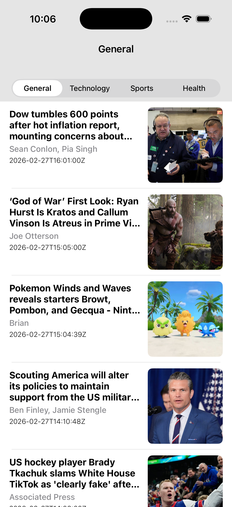

# NewsApp

A modern iOS news reader app built with Swift and UIKit that fetches and displays top headlines from [NewsAPI.org](https://newsapi.org).

## Features

- Browse top headlines across four categories: **General**, **Technology**, **Sports**, and **Health**
- Clean table view with article thumbnails, titles, author names, and publication dates
- Tap any article to view a full detail screen with the complete description and content
- Asynchronous image loading for smooth scrolling performance
- Category switching via a segmented control

## Screenshots

| News Feed | Article Detail |
|-----------|---------------|
|  | |

## Requirements

- **iOS** 15.0+
- **Xcode** 14.0+
- **Swift** 5.7+
- A free API key from [NewsAPI.org](https://newsapi.org/register)

## Getting Started

### 1. Clone the repository

```bash
git clone https://github.com/AbdulkarimMziya/NewsApp.git
cd NewsApp
```

### 2. Add your API key

The app reads the API key from a `Secret` struct. Create a new Swift file inside the `NewsApp` target (e.g., `NewsApp/Supporting Files/Secret.swift`) and add:

```swift
enum Secret {
    static let apiKey = "YOUR_NEWSAPI_KEY_HERE"
}
```

> **Note:** This file is excluded from version control to keep your key private. Never commit your API key to source control.

### 3. Open and run

Open `NewsApp/NewsApp.xcodeproj` in Xcode, select a simulator or connected device, and press **Run** (⌘R).

## Architecture

The project follows the **MVC (Model-View-Controller)** pattern and uses modern Swift concurrency (`async`/`await`).

```
NewsApp/
├── Controllers/
│   └── NewsFeedViewController.swift   # Main feed screen
├── Models/
│   ├── NewsModal.swift                # Article & NewsResponse Codable models
│   └── AppError.swift                 # Custom error types
├── Views/
│   ├── ArticleTableViewCell.swift     # Custom table view cell
│   └── ArticleDetailViewController.swift  # Article detail screen
├── Network Services/
│   ├── NewsAPIService.swift           # Fetches headlines & images from NewsAPI
│   └── NetworkHelper.swift            # Thread-safe URLSession actor
└── Extensions/
    └── NewsFeedTableExtension.swift   # UITableViewDataSource & Delegate
```

### Key components

| Component | Responsibility |
|-----------|---------------|
| `NewsFeedViewController` | Hosts the segmented control and table view; triggers data loads |
| `NewsAPIService` | Builds API requests and decodes `NewsResponse` JSON |
| `NetworkHelper` | Swift `actor` wrapping `URLSession` for safe concurrent network calls |
| `ArticleTableViewCell` | Displays thumbnail, title, author, and date for each article |
| `ArticleDetailViewController` | Full-screen scrollable detail view for a selected article |

## API

News data is sourced from [NewsAPI.org](https://newsapi.org). The app requests **top headlines** for the United States filtered by the selected category:

```
GET https://newsapi.org/v2/top-headlines?country=us&category=<category>&apiKey=<key>
```

## Running Tests

Open the project in Xcode and press **⌘U** to run both the unit tests (`NewsAppTests`) and UI tests (`NewsAppUITests`).

## License

This project is available for personal and educational use.
